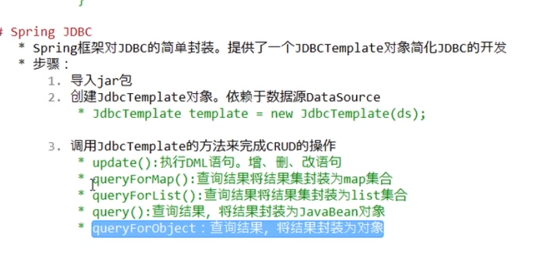

[TOC]

# JDBC

- JDBC中的各个类和接口
- java database connectivity，java的数据库连接
- 用一套Java代码操作所有关系型的数据库
- JDBC：定义了一套操作所有关系型数据库的规则（接口）
- 数据库驱动
- 真正执行的代码是驱动jar包中的实现类
- 
- 详解各个对象
  - 
  - 
  - 
  - 
  - 
  - 
  - 
  - 
  - 
  - 
  - 
  - 
  - 
  - 
  - 
  - 
  - 配置文件
  - 
  - 
  - 
  - 
  - 
  - 
  - 
  - 
  - 
- JDBC控制事务
  - 
  - 
  - 
  - 
  - 
  - 
  - 
- 数据库连接池
  - Spring  JDBC： JDBC Template
  - 其实一个容器（集合），存放数据库连接的容器。
    - 当系统初始化好后，容器被创建，容器中会申请一些连接对象，当用户来访问数据库时，从容器中获取连接对象，用完，再返还给连接池。
    - interface DataSource
    - C3P0连接池（旧）
    - 
    - 
    - 
    - 
    - Druid：数据库连接池实现技术，由阿里巴巴提供（新，高效）
    - 
    - 
  - Spring  JDBC：是Spring框架对JDBC的简单封装,提供了一个JDBCTemplate对象简化JDBC开发
    - 调用JDBCTemplate的方法完成CRUD的操作
    - 
    - 

