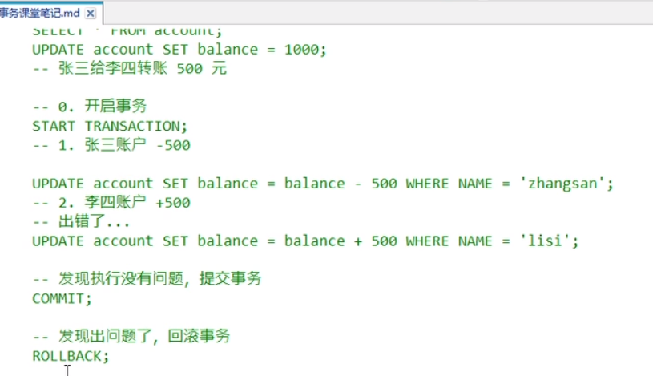

[TOC]

# JavaWeb

- 用Java语言开发网站
- 数据库
- 网页前端
- web核心技术
- 做个旅游管理的网站

## 一、MySQL-数据库

- DataBse
- 存储管理数据的仓库
- DDL - 定义数据库的语言
- DML - 数据操作语言
- DQL - 数据查询语言
- DCL - 数据控制语言

### 1.1 DDL

- 操作数据库：CRUD

  - Create，创建

  - Retrieve，查询

  - Update，修改

  - Delete，删除

  - ```sql
    show databases; -- 查询所有数据库名称
    show create database 数据库名称; -- 查询某个数据库的字符集
    create database db1; -- 创建db1名称的数据库
    create database if not exists db2; -- 创建前进行判断是否已经存在同名数据库
    create database db3 character set gbk; -- 创建字符集为gbk的数据库db3
    create databse if not exists db4 character set gbk; -- 结合判断和指定字符集
    alter database 数据库名称 character set 字符集名称; -- 修改字符集名称
    desc 表名; -- 查看表结构
use 数据库名; -- 选择数据库
    select database(); -- 进入数据库
    create table 表名; -- 创建表
    create table stu like student; -- 创建相同的表
    drop table (if exists) student ; -- 删除表 
    show create table student; -- 查询表单字符集
    alter table stu add gender varchar(); -- 增加一列
    alter table stu change gender sex varchar(20); -- 修改列的名字和数据元素
     alter table stu drop sex; -- 删除表的某列
     timestamp -- 时间戳
     ALTER TABLE stu ADD insert_time TIMESTAMP NULL DEFAULT CURRENT_TIMESTAMP;//实时更新的时间戳
    
    ```
    

- 客户端图形化工具：SQL Yog

### 1.2 DML

- 增加数据

- 删除数据

- 修改数据

- ```sql
  insert into 表名(列名1，列名2，...) values(值1，值2...);
  
  ```

- 数据查询语言DQL，数据操纵语言DML，数据定义语言DDL，数据控制语言DCL。

### 1.3 DQL

- 查询

- ```sql
  select * from 表名;
  select -- 字段列表
  from -- 表名列表
  where -- 条件列表
  group by -- 分组
  having -- 分组之后条件
  order by -- 排序
  limit -- 分页限定
  
  ```

  - DQL查询语句：

    - 排序查询

    - 聚合函数

    - 分组查询

    - 分页查询

    - ```sql
      SELECT * FROM stu ORDER BY math DESC; -- 排序方式:默认升序；升序asc，降序desc
      SELECT * FROM stu ORDER BY math ASC; -- 排序方式:默认升序；升序asc，降序desc
      
      -- 按照数学成绩排序，相同按英语成绩排序
      SELECT * FROM stu ORDER BY math ASC,english ASC;
      
      -- 聚合函数，将一列作为总体进行计算，列的计算
      -- count max min sum avg
      SELECT COUNT(NAME) FROM stu; -- 人数
      -- 聚合函数会排除NULL的数据
      SELECT COUNT(IFNULL(english,0)) FROM stu;
      SELECT COUNT(*) FROM stu;
      SELECT MAX(math) FROM stu;
      SELECT MIN(math) FROM stu;
      SELECT SUM(math) FROM stu;
      SELECT AVG(math) FROM stu;
      
      -- 分组查询 分组字段+聚合函数
      SELECT gender,AVG(math) FROM stu GROUP BY gender;
      SELECT * FROM stu;
      SELECT gender,COUNT(NAME) FROM stu GROUP BY gender;
      
      -- 性别分组排序，分数低于60不参与分组，分组前进行限定操作
      SELECT gender,AVG(math),COUNT(NAME) FROM stu WHERE math>60 GROUP BY gender HAVING COUNT(NAME)>2;
      
      -- where 和 having 区别
      -- where 在分组之前限定，having在分组后进行限定；
      -- where不能跟聚合函数，having可以进行聚合函数判断
      
      
      ```

    - 

  - 约束

    - ```sql
      -- 外键约束
      -- foreign key 
      -- 数据冗余
      -- 拆分员工表和部门表，然后让两个表关联
      CREATE TABLE 表ming(
      	...
      	外键列
      	CONSTRAINT 外键名称 FOREIGN KEY (外键列名称) REFERENCES 主表名称(主表列名称)
      );
      CONSTRAINT emp_dept_fk FOREIGN KEY (dep_id) REFERENCES department(id);
      
      ALTER TABLE employee DROP FOREIGN KEY emp_dept_fk ; -- 删除外键
      ALTER TABLE employee ADD CONSTRAINT emp_dept_fk FOREIGN KEY (dep_id) REFERENCES department(id) ; -- 创建表后添加外键 
      
      -- 级联操作
      ALTER TABLE employee ADD CONSTRAINT emp_dept_fk FOREIGN KEY 
      (dep_id) REFERENCES department(id) ON UPDATE CASCADE ON DELETE CASCADE;
      -- 数据库的设计
      -- 1.多表之间的关系
      -- 2. 数据库设计的范式
      
      ```

    - 

  - 多表之间的关系

    - 

  - 范式

    - 第一范式~第五范式 + 巴斯-科德范式（BCNF）
    - 一般学前三种范式
    - 码：一个属性被其他所有属性完全依赖
    - 第一范式：不可分割
    - 第二范式：存在部分依赖
    - 第三范式：消除传递依赖
    - 消除部分依赖

  - 数据库的备份和还原

    - 命令行

    - ```sql
      -备份
      mysqldump -u用户名 -p密码 > 保存路径
      还原
      1.登录数据库
      2.创建数据库
      3.使用数据库
      4.执行文件，source 文件路径
      ```

    - 图形化工具


- 基础查询

  - 多个字段查询

  - 去除重复

  - 计算列

  - 起别名

  - ```sql
    
    
CREATE TABLE `stu` (
      `id` INT DEFAULT NULL,
      `name` VARCHAR(32) CHARACTER SET utf8mb4 COLLATE utf8mb4_0900_ai_ci DEFAULT NULL,
      `age` INT DEFAULT NULL,
      `score` DOUBLE(4,1) DEFAULT NULL,
      `birthday` DATE DEFAULT NULL,
      `insert_time` TIMESTAMP NULL DEFAULT CURRENT_TIMESTAMP ON UPDATE CURRENT_TIMESTAMP
    );
    
    DROP TABLE stu ; -- 删除表
    
    INSERT INTO stu VALUES(1,'洋洋',3,100.88,'1998-4-19',NULL); -- 添加数据
    INSERT INTO stu(id,NAME,age) VALUES(2,'文哥',23); -- 添加数据
    INSERT INTO stu VALUES(3,'文文',25,100,'1999-8-22'); -- 添加数据
    INSERT INTO stu VALUES(4,'小文',28,200,'1999-8-22'); -- 添加数据
    
    `stu`
    
    ALTER TABLE stu DROP insert_time; -- 删除表列
    ALTER TABLE stu ADD insert_time TIMESTAMP NULL DEFAULT CURRENT_TIMESTAMP ; -- 添加表列
     `insert_time` TIMESTAMP NULL DEFAULT CURRENT_TIMESTAMP ON UPDATE CURRENT_TIMESTAMP;
    DELETE FROM stu WHERE id=1; -- 删除表行（一行数据）
    DELETE FROM stu ; -- 删除全部表数据，有多少条记录就删多少次
    TRUNCATE TABLE stu; -- 删除全部表数据,效率更高
    UPDATE stu SET age=18 WHERE id=1; -- 修改表的数据
    UPDATE stu SET NAME="文哥",age=18,score=500 WHERE id=3; -- 修改表的数据
    UPDATE stu SET id=3,age=18,score=500 WHERE id=3; -- 修改表的数据
    UPDATE stu SET insert_time=CURRENT_TIMESTAMP WHERE id=1; -- 修改时间 
    UPDATE stu SET insert_time=CURRENT_TIMESTAMP WHERE id=4; -- 修改时间 
    UPDATE stu SET score=200,birthday='1999-9-20' WHERE id=2; -- 修改表的数据
    
    DROP TABLE stu ; -- 删除表
    
    USE test;
    SELECT DATABASE(); -- 进入数据库
    SHOW TABLES;
    DESC stu;
    SELECT * FROM stu; -- 查看表数据
    CREATE TABLE stu(
    id INT,
    NAME VARCHAR(20),
    age INT,
    gender VARCHAR(5),
    address VARCHAR(20),
    math INT,
    english INT,
    insert_time TIMESTAMP NULL DEFAULT CURRENT_TIMESTAMP
    );
    
    INSERT INTO stu(id,NAME,age,gender,address,math,english) VALUES(1,'小白',11,'男','浙江',89,90),(2,'小红',45,'男','北京',55,98),(3,'小黑',88,'女','深圳',9,100),
    (4,'小黄',25,'男','广东',66,66),(5,'小绿',34,'女','上海',75,68),(6,'小紫',88,'女','深圳',99,10);
    
    SELECT * FROM stu; -- 查看表数据
    SELECT NAME,age FROM stu;
    
    SELECT 
    	id, -- 编号
    	NAME, -- 姓名
    	math -- 数学成绩
    FROM
    	stu; -- 学生
    
    SELECT address FROM stu; -- 查询地址
    SELECT DISTINCT address FROM stu; -- 查询地址，去掉重复
    
    -- 计算 math 和 english 分数之和
    SELECT NAME,math,english,math+english AS 总分 FROM stu;
    -- 如果遇到null，相加以后为null
    SELECT NAME,math,english,math+IFNULL(english ,0) 总分 FROM stu;
    
    SELECT * FROM stu;
    -- 查询年龄大于40岁
    SELECT * FROM stu WHERE age>40;
    SELECT * FROM stu WHERE age<>44;
    -- 查询年龄大于10，小于等于50
    SELECT * FROM stu WHERE age>=10 && age<=50;
    SELECT * FROM stu WHERE age>=10 AND age<=50;
    SELECT * FROM stu WHERE age BETWEEN 20 AND 50;
    SELECT * FROM stu WHERE age=11 OR age=25 OR age=88;
    
    SELECT * FROM stu WHERE english IS NOT NULL;
    
    -- like是模糊查询
    SELECT * FROM stu WHERE NAME LIKE "小%";
    SELECT * FROM stu WHERE NAME LIKE "_红";
    SELECT * FROM stu WHERE NAME LIKE "%白%";
    ```
    
  
- 多表查询

  - 笛卡尔积
  - 消除无用数据
  - 分类
    - 内连接查询
      - 隐式 where
      - 
      - 显式
      - 
      - inner可省略
    - 外连接查询
      - 左外连接
      - 
      - 左表所有数据以及交集部分
      - 右外连接
    - 子查询
      - 
      - 
      - 
      - 
      - 
      - 
      - 
      - 
      - 
      - 
      - 
      - 

- 事务

  - 事务的基本介绍
    - 包含多个操作
    - 操作要么同时成功，要么同时失败，出现异常回滚，成功提交
    - 开启事务：start transaction
    - 回滚：rollback
    - 提交：commit
    - 
    - MySQL中事务自动提交（一条DML语句就会自动提交一次事务）
    - 
    - 
  - 事务的四大特征
    - 原子性：不可分割的最小操作单位
    - 持久性：事务一旦提交或回滚，数据库会持久化保存数据
    - 隔离性：事务之间相互独立
    - 一致性：事务操作前后，总量不变
  - 事务的隔离级别（了解）
    - 多个事务之间隔离，相互独立，多个事务操作同一批数据，会引发问题
      - 脏读
      - 不可重复读（虚读）
      - 幻读
    - 隔离级别：
    - 
    - 

### 1.4 DCL

- 管理用户，授权
  - 管理用户
    - 添加，删除，修改，查询用户
    - 
    - 
    - 
    - 
  - 
- DBA：数据库管理员

